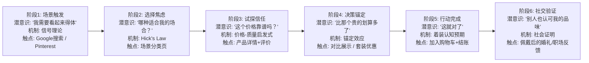

# Cufflinks Men — 产品哲学与场景心理学蓝图

> 核心利基词：**cufflinks men**
> 域名：cufflinksmen.com
> 价格带：$5–$100（集中在 $20 以下）
> 核心受众：**婚礼伴郎团 + 职场男性 + 礼品买手**

---

## 1. 深层动机拆解

### 核心理论支撑

基于消费者行为研究，袖扣消费由以下 4 大心理引擎驱动：

1. **信号理论 (Signaling Theory)** — 袖扣是一种低频但高密度的「身份信号装置」。历史上与皇室和精英阶层绑定，在现代职场中，它是"我注重细节、我有品位"的视觉速记符号。
2. **着装认知效应 (Enclothed Cognition)** — 穿戴精致配件会直接影响佩戴者的心理状态和行为表现。佩戴袖扣的男性报告更高的自信度和专业感（"The James Bond Effect"）。
3. **微表达理论 (Micro-Expression Theory)** — 在男性时尚选择极度受限的环境中（西装=制服），袖扣是唯一允许的「可控个性释放阀」。它小、隐蔽、只在特定角度可见——恰好满足了"想表达个性但不想破坏正式感"的精准需求。
4. **礼品锚定效应 (Gift Anchoring Effect)** — 袖扣市场的巨大驱动力来自**婚礼伴郎礼物 (Groomsmen Gifts)**。一个 $15 的袖扣，经过刻字定制后，在伴郎眼中的感知价值远超实际价格——它变成了"那天的记忆载体"。

### Functional Jobs (实用任务)
- 固定法式袖口（物理功能）
- 为正式场合（婚礼、商务、晚宴）提供得体的着装完整度
- 以极低成本刷新现有西装的视觉效果

### Emotional / Social Jobs (情感/社会任务)
- **婚礼场景**：新郎通过赠送统一袖扣给伴郎团，完成"兄弟情谊的物质化仪式"
- **职场场景**：在无差别的西装海洋中，用一个 $15 的配件说出"我和你们不一样"
- **礼品场景**：送出一个"他会真正用到的、有纪念意义的东西"——而不是又一个马克杯

---

## 2. 情感基调准则 (North Star Tone)

### 北极星情感：**"Quiet Confidence" — 沉稳的自信**

> 不是炫耀，不是高攀；是一个男人清楚自己要什么，安静地完成最后一个细节的那种笃定感。

**调性关键词**：
- Understated（低调）
- Sharp（利落）
- Intentional（刻意为之）
- No-nonsense（不废话）
- Approachable（亲切不端着）

**禁止出现的调性**：
- Luxury / Opulent（奢华——$15 的产品用这个词就是自杀）
- Exclusive（排他——我们要的是"每个男人都该有"）
- Trendy / Fashion-forward（潮流——袖扣的魅力恰恰在于它的经典不变）
- Feminine / Romantic（柔美浪漫——这是给男人的，写法要直接、干脆）
- Desperate urgency（制造焦虑——"限时抢购"在这个品类会让人觉得是地摊货）

---

## 3. 品牌公敌确立 (The Enemy)

### 公敌：**"过度包装的虚假奢华" (Overpackaged Pretension)**

我们的对立面不是便宜货，而是那些把 $10 成本的东西包装成 $300"奢侈品"的品牌。那些用"heirloom quality"、"bespoke craftsmanship"来形容一个机器冲压的合金袖扣的商家。

> **我们的立场**：一副好袖扣不需要一个奢侈品的故事。它需要的是对的金属质感、稳固的弹性机关、和一个不让你在婚礼上掉面子的外观。我们诚实地告诉你它是什么材质，然后让你自己判断值不值。

---

## 4. 对 SEO 规划的指导

- **选词策略**：避开 "luxury cufflinks"、"designer cufflinks" 等高溢价词（与我们的价格带不匹配），主攻 "cufflinks for men"、"groomsmen cufflinks"、"silver cufflinks men"、"personalized cufflinks men" 等大流量实用型词
- **CTA 设计**：绝不用 "Buy Now" 或 "Limited Offer"。用 "Find Your Style"、"Explore the Collection"、"See the Details" 这种邀请式语言
- **内容策略**：大量产出婚礼场景内容（"Best Groomsmen Gift Ideas 2025"、"How to Match Cufflinks to Your Wedding Suit"），因为**婚礼是袖扣消费的第一大流量入口**

---

## 5.「理论 × 场景」乘法表 (Theory × Scenario Multiplication)

| 理论框架 | 场景映射 | ✅ Do（正确做法） | ❌ Don't（错误做法） |
|---------|---------|-----------------|-------------------|
| 信号理论 (Signaling) | 首页 Hero | 展示一个穿好西装、正在扣袖扣的男人手部特写——传达"完成最后一步"的仪式感 | 展示袖扣孤零零放在天鹅绒上，脱离穿戴场景 |
| 着装认知 (Enclothed Cognition) | 产品页描述 | "Slide them on and feel the difference" — 强调佩戴后的心理状态变化 | "Made with premium alloy" — 只堆材料参数，忽略情感 |
| 微表达理论 (Micro-Expression) | 分类页 | 按风格意图分类："Classic Professional"、"Wedding Day"、"Conversation Starter" — 帮用户找到自己的表达方式 | 按材质分类 "Steel / Brass / Copper" — 用户根本不在乎这些 |
| 礼品锚定效应 (Gift Anchoring) | 伴郎礼物场景页 | "A $15 gift they'll wear to every wedding after yours" — 强调持续使用场景 | "Affordable groomsmen accessory" — 把焦点放在便宜上，送礼者会觉得没面子 |
| 完成感心理 (Completion Effect) | 购物车 / 套装页 | 推荐"袖扣+领带夹"组合，文案用 "Complete the look" — 激活未完成焦虑 | 硬推 upsell："You might also like these tie clips" — 没有心理学锚点 |

---

## 6. 全局潜意识体验链路图 (Subconscious Journey Map)

---

## 7. 视觉表达准则

### 设计哲学名称
**"Forged Detail"（锻造细节）**
> 灵感来自金属加工的精确与力量感。不是奢华珠宝的柔光，而是机械零件般的精准、利落、有重量感的美学。每一张图、每一个字都要传递"这个东西是认真做的"。

### 视觉元素规范
| 维度 | 规则 |
|------|------|
| **空间与形式** | 中等密度排版。充足留白但不虚空——男性用户讨厌"太空"的页面，会觉得没内容 |
| **色彩语义** | 主色：深炭灰 (#1C1C1E) = 金属质感与专业。辅色：暖银 (#C0C0C0) = 金属光泽。强调色：深琥珀 (#B8860B) = 温暖但不女性化 |
| **字体调性** | 标题用几何无衬线（如 DM Sans / Outfit）传递现代利落感。正文用中性等宽或人文无衬线，避免衬线体（衬线在这个价格带会显得"在装"） |
| **摄影/插图** | 纪实风特写为王。手部佩戴特写、法式袖口细节、西装场景。绝对避免珠宝盒里的"产品证件照"风格 |
| **信息密度** | 产品页用清晰的参数表格（材质、机关类型、尺寸、重量）。男性买家极度依赖参数做决策 |

### Anti-Patterns（视觉禁区）
- ❌ 粉色/玫瑰金色调（即使是婚礼场景也不行——这是给男人的站）
- ❌ 花体字/手写体 Logo（会让人觉得这是首饰店，不是男士配件店）
- ❌ 天鹅绒/丝绸布景的产品图（暗示"廉价模仿奢侈品"）
- ❌ 模特全身照（袖扣是"细节级"产品，只需手部/袖口区域特写）

---

## 8. 品类品线延展 (Category Architecture)

### L2 品类关键词选定

基于亚马逊高频搜索词和 SEO 长尾数据，确定以下 3 大核心产品分类：

### 分类 1: **Silver Cufflinks Men**
- **拦截意图**：搜索"silver cufflinks"的用户是袖扣市场最大流量池。银色=安全牌、百搭、正式场合首选。
- **长尾词举例**：`silver cufflinks for wedding`, `sterling silver cufflinks men`, `silver round cufflinks men`
- **选品标准**：银色/银镀金属，Bullet Back 或 Whale Back 机关，圆形/方形经典造型为主

### 分类 2: **Gold Cufflinks Men**
- **拦截意图**："gold cufflinks men"是第二大流量入口。金色袖扣=正式晚宴与婚礼新郎的标配。出镜率极高的婚礼刚需品。
- **长尾词举例**：`gold cufflinks for groom`, `rose gold cufflinks men`, `gold plated cufflinks men`
- **选品标准**：金色/玫瑰金镀层，搭配婙石或条纹装饰，适配婚礼主题

### 分类 3: **Novelty Cufflinks Men**
- **拦截意图**："novelty cufflinks"代表另一种完全不同的购买心理——不是为了"得体"，而是为了"有趣/表达个性"。这是伴郎礼物和日常办公的第一大细分。
- **长尾词举例**：`funny cufflinks for men`, `superhero cufflinks men`, `music note cufflinks men`
- **选品标准**：主题型（运动/音乐/动物/职业符号等），搪瓷彩色填充，强调趣味性和对话启动能力
